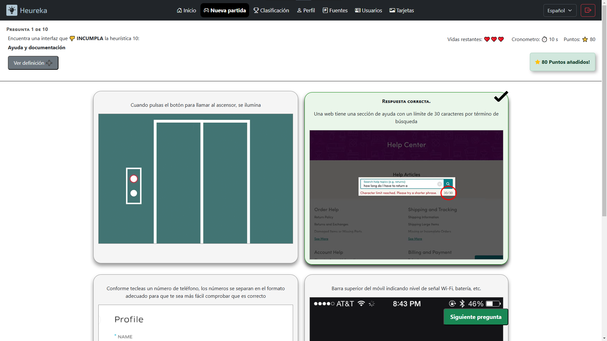

# Heureka
Aplicación gamificada utilizada en la asignatura Interfaces de Usuario, del Grado de Ingeniería Informática de la Universidad de Murcia, para promover entre los alumnos el aprendizaje de las 10 heurísticas de Nielsen.


## Tecnologías utilizadas

- **Node.js y Express** para el servidor
- **MongoDB** para la base de datos
- **HTML/CSS/JS** para el frontend

## Requisitos

- [Node.js](https://nodejs.org/es)

## Despliegue 

1. **Clonar el repositorio**

    ```bash
   git clone https://github.com/EfrosEM/Heureka
   ```

2. **Acceder al directorio raíz del proyecto**

    ```bash
   cd Heureka
   ```

3. **Compilar la aplicación para instalar las dependencias**

    ```bash
   npm install
   ```

4. **Ejecutar la aplicación**
   
    ```bash
   npm run start
   ```

5. **Acceder a la aplicación**

    [http://localhost:5000](http://localhost:5000)

## Configuración

Para configurar la aplicación se deben modificar las variables  de entorno del archivo `.env`:

```
# Configuración general
PORT=5000                           # Puerto en el que se ejecutará la aplicación
NODE_ENV="prod"                     # Entorno de la aplicación: dev, prod, test

# Configuración de la base de datos
DB_NAME="HeurekaDB"                 # Nombre de la base de datos
MONGODB_URI=""                      # URI de conexión a MongoDB

# Configuración del email
EMAIL_USER=""                       # Usuario del email de recuperación de contraseña
EMAIL_PASS=""                       # Contraseña del email de recuperación de contraseña
URL_HEUREKA=""                      # URL de la aplicación para enlaces de recuperación

# Configuración de la aplicación
PASSWORD_MIN_LENGTH=8               # Longitud mínima de la contraseña
USERNAME_MAX_LENGTH=30              # Longitud máxima del nombre de usuario
BONUS_POINTS=100                    # Puntos de bonificación por victoria
```

## Cargar datos

Una vez desplegada y configurada la aplicación, para cargar los datos necesarios en una base de datos vacía se deberán enviar las siguientes peticiones HTTP al servidor:

- Para cargar las Heuristicas y Tarjetas, almacenadas en los ficheros .json del direcctorio `Heureka/data`.
  
  ```bash
   curl -X POST http://localhost:5000/api/cargar-datos -H "Content-Type: application/json"
   ```

- Para cargar un usuario administrador, con nombre de usuario `admin` y contraseña `admin` (Estas credenciales podrán ser modificadas una vez dentro de la aplicación).
  
  ```bash
   curl -X POST http://localhost:5000/api/cargar-admin -H "Content-Type: application/json"
   ```

## Estructura del proyecto

El proyecto está organizado según la siguiente estructura de directorios:

```
Heureka
|  
|   # CLIENTE #
├───public                      # Ficheros servidos al cliente 
│   ├───audio                   # Efectos de sonido
│   ├───html                    # Páginas HTML
│   │   └───lang                # Traducciones
|   │       ├───en.json
|   │       └───es.json
│   ├───images                  # Imágenes
│   │   └───tarjetas            # Imágenes de las tarjetas
│   ├───js                      # Scripts del cliente
│   │   ├───controller          # Controlador intermediario entre modelo y vista
│   │   ├───model               # Clases del modelo de partida
|   |   |   ├───Cronometro.js
|   |   |   ├───Partida.js
|   │   │   └───Pregunta.js
│   │   ├───test                # Pruebas unitarias
│   │   └───utils               # Scripts de utilidades variadas
│   └───stylesheets             # Ficheros CSS
|   
|   # SERVIDOR #
├───node_modules                # Paquetes de dependencias del servidor
├───config                      # Ficheros de configuración del servidor
|   ├───config.js               # Fichero de carga de variables de entorno
|   └───passport.js             # Fichero de configuración del passport
├───data                        # Datos del juego (para ser cargados en la base de datos)
|   ├───heuristicas.json
|   └───tarjetas.json
├───models                      # Clases del modelo de la base de datos
|   ├───Heuristica.js
|   ├───Tarjeta.js
|   └───Usuario.js
├───routes                      # Rutas de las peticiones al servidor
|   ├───index.js                # Indice de rutas
|   ├───admin.js                # Rutas de peticiones del administrador
|   └───users.js                # Rutas de peticiones de usuarios
├───app.js                      # Código de arranque del servidor
├───package.json                # Fichero de configuración de Node.js
└───.env                        # Fichero de variables de entorno 

```

## Vista previa

**Pantalla de inicio**


**Partida en curso**




## Autor

- Eduardo Espinosa Meroño  ([@EfrosEM](https://github.com/EfrosEM)) – eduardo.espinosam@um.es
